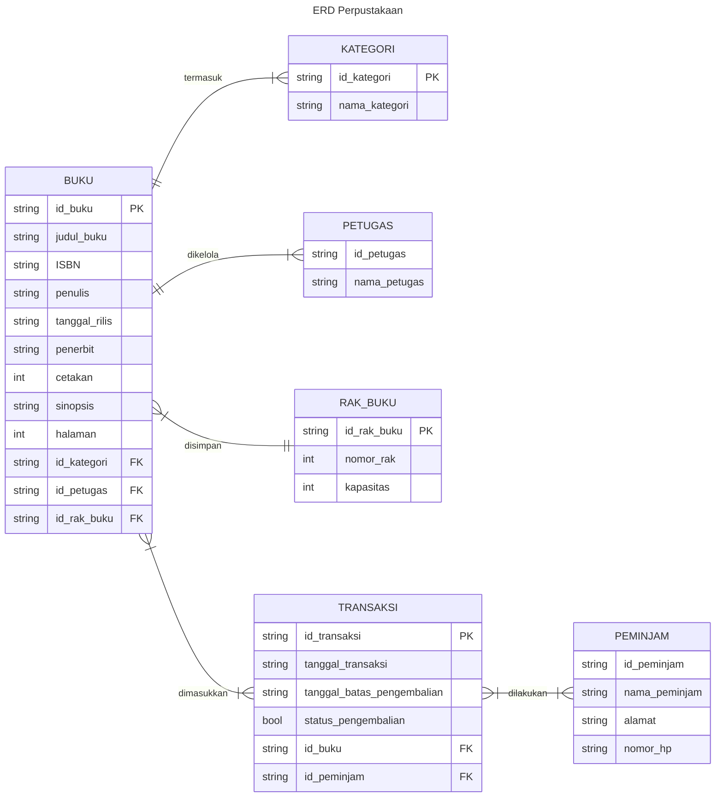

```mermaid

---
title: ERD Perpustakaan
---
erDiagram
direction LR
    BUKU ||--|{ KATEGORI : termasuk
    BUKU ||--|{ PETUGAS : dikelola
    BUKU }|--|| RAK_BUKU : disimpan
    BUKU }|--|{ TRANSAKSI : dimasukkan
    TRANSAKSI }|--|{ PEMINJAM : dilakukan

    BUKU {
        string id_buku PK
        string judul_buku
        string ISBN
        string penulis
        string tanggal_rilis
        string penerbit
        int cetakan
        string sinopsis
        int halaman
        string id_kategori FK
        string id_petugas FK
        string id_rak_buku FK
    }

    KATEGORI {
        string id_kategori PK
        string nama_kategori
    }

    RAK_BUKU {
        string id_rak_buku PK
        int nomor_rak
        int kapasitas
    }

    PETUGAS {
        string id_petugas
        string nama_petugas
    }

    PEMINJAM {
        string id_peminjam
        string nama_peminjam
        string alamat
        string nomor_hp
    }

    TRANSAKSI {
        string id_transaksi PK
        string tanggal_transaksi
        string tanggal_batas_pengembalian
        bool status_pengembalian
        string id_buku FK
        string id_peminjam FK
    }

```