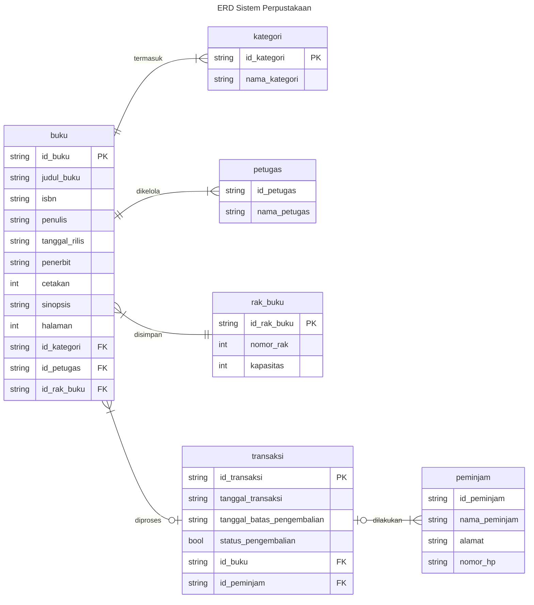

```mermaid

---
title: ERD Sistem Perpustakaan
---
erDiagram
direction LR
    buku ||--|{ kategori : termasuk
    buku ||--|{ petugas : dikelola
    buku }|--|| rak_buku : disimpan
    buku }|--o| transaksi : diproses
    transaksi |o--|{ peminjam : dilakukan

    buku {
        string id_buku PK
        string judul_buku
        string isbn
        string penulis
        string tanggal_rilis
        string penerbit
        int cetakan
        string sinopsis
        int halaman
        string id_kategori FK
        string id_petugas FK
        string id_rak_buku FK
    }

    kategori {
        string id_kategori PK
        string nama_kategori
    }

    rak_buku {
        string id_rak_buku PK
        int nomor_rak
        int kapasitas
    }

    petugas {
        string id_petugas
        string nama_petugas
    }

    peminjam {
        string id_peminjam
        string nama_peminjam
        string alamat
        string nomor_hp
    }

    transaksi {
        string id_transaksi PK
        string tanggal_transaksi
        string tanggal_batas_pengembalian
        bool status_pengembalian
        string id_buku FK
        string id_peminjam FK
    }

```